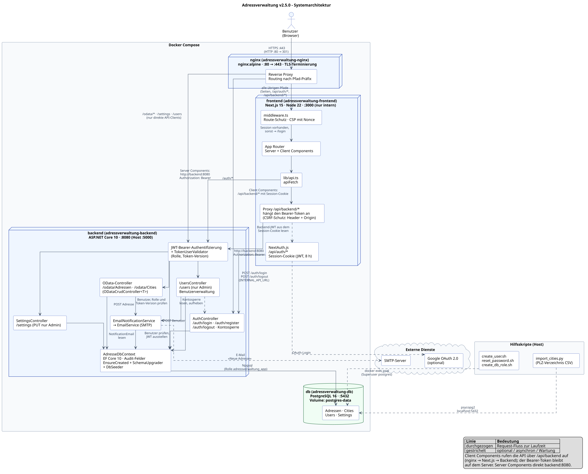
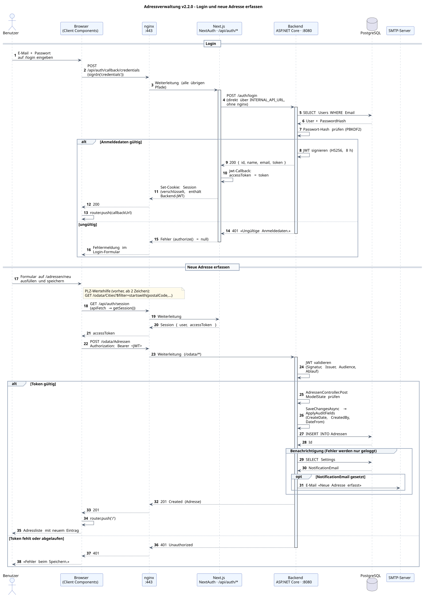

# Adressverwaltung – Tutorial WebApp v2.4.0

Adressverwaltungs-WebApp mit Login, CRUD für Adressen und Städte (PLZ-Verzeichnis), PLZ-Wertehilfe und E-Mail-Benachrichtigung bei neuen Adressen.

## Tech-Stack

- **Frontend:** Next.js 15 (TypeScript, Tailwind CSS, App Router), NextAuth.js
- **Backend:** ASP.NET Core 10 Web API mit OData v4, JWT-Bearer-Authentifizierung
- **Datenbank:** PostgreSQL 16
- **ORM:** Entity Framework Core 10 (Npgsql)
- **Reverse Proxy:** nginx (TLS-Terminierung, HTTP → HTTPS)
- **Container:** Docker / Docker Compose

## Architektur



nginx verteilt die Anfragen nach Pfad-Präfix:

| Pfad | Ziel |
|------|------|
| `/odata/*`, `/auth/*`, `/settings` | Backend (`backend:8080`) |
| alle übrigen Pfade | Frontend (`frontend:3000`) |

### Ablauf: Login und neue Adresse erfassen



Jeder der 44 Schritte ist in der Schulungsunterlage `documentation/Schulungsunterlage_Sequenzdiagramm.pdf` erläutert.

Beim Login stellt das Backend ein JWT aus, das NextAuth im verschlüsselten Session-Cookie ablegt. Der Browser ruft die API über den Proxy `/api/backend` der eigenen Anwendung auf; dieser liest das Token aus dem Cookie und sendet es als `Authorization: Bearer` an das Backend. Im Browser ist das Token nie sichtbar.

Die Quellen der Diagramme liegen in `documentation/Systemarchitektur.puml` und `documentation/Sequenzdiagramm.puml`. SVG neu erzeugen:

```bash
docker run --rm -v "$PWD/documentation:/data" plantuml/plantuml -tsvg "/data/*.puml"
```

## Schnellstart mit Docker

### 1. TLS-Zertifikat erzeugen (einmalig)

Die Zertifikate sind nicht im Repository enthalten. Damit der Browser https://localhost als sicher anzeigt, stellt [mkcert](https://github.com/FiloSottile/mkcert) das Zertifikat mit einer lokalen Zertifizierungsstelle aus, der Betriebssystem und Browser vertrauen:

```bash
mkcert -install     # einmalig pro Rechner: lokale Zertifizierungsstelle anlegen und als vertrauenswürdig eintragen
mkdir -p nginx/ssl
mkcert -cert-file nginx/ssl/cert.pem -key-file nginx/ssl/key.pem localhost 127.0.0.1 ::1
```

Läuft der Stack bereits, lädt `docker exec adressverwaltung-nginx nginx -s reload` das neue Zertifikat. Den Browser danach neu starten.

Ohne mkcert funktioniert auch ein selbstsigniertes Zertifikat; der Browser zeigt die Seite dann als «nicht sicher» an:

```bash
openssl req -x509 -nodes -days 365 -newkey rsa:2048 \
  -keyout nginx/ssl/key.pem -out nginx/ssl/cert.pem \
  -subj "/CN=localhost" -addext "subjectAltName=DNS:localhost,IP:127.0.0.1"
```

### 2. Geheimnisse anlegen

Passwörter und Schlüssel liegen in der Datei `.env` im Projektstamm und sind nicht im Repository enthalten. Vorlage kopieren und die Platzhalter ersetzen:

```bash
cp .env.example .env
openssl rand -hex 24      # je ein Wert für POSTGRES_PASSWORD und APP_DB_PASSWORD
openssl rand -base64 48   # je ein Wert für JWT_KEY und NEXTAUTH_SECRET
```

Docker Compose liest `.env` automatisch und bricht mit einer Meldung ab, wenn `POSTGRES_PASSWORD`, `APP_DB_PASSWORD`, `JWT_KEY` oder `NEXTAUTH_SECRET` fehlen.

Das Backend verbindet sich mit der Rolle `adressverwaltung_app`, nicht als Superuser `postgres`. Bei einer neuen Datenbank entsteht die Rolle beim ersten Start. Bei einer bestehenden Datenbank einmalig `./scripts/create_db_role.sh` ausführen (auch nach einer Änderung von `APP_DB_PASSWORD`).

### 3. Services starten

```bash
# Alle vier Services (db, backend, frontend, nginx) bauen und starten
docker compose up --build -d

# Logs verfolgen
docker compose logs -f backend
```

Nach dem Start:

- **App:** https://localhost (Port 80 leitet auf 443 um)
- **Backend direkt:** http://localhost:5000 (z.B. `/odata/Adressen`, erfordert Bearer-Token)
- **PostgreSQL:** `localhost:5432`, Datenbank `adressverwaltung`

Backend und PostgreSQL sind nur an `127.0.0.1` gebunden; aus dem Netzwerk ist ausschliesslich nginx erreichbar.

### 4. Anmelden

Beim ersten Start mit leerer `Users`-Tabelle wird ein Admin-Benutzer angelegt (`Seed:AdminEmail`, Standard `admin@example.com`). Das Passwort stammt aus `SEED_ADMIN_PASSWORD` in `.env`; ist der Wert leer, erzeugt das Backend ein Zufallspasswort und schreibt es einmalig ins Log (`docker compose logs backend`). Das Passwort lässt sich jederzeit neu setzen:

```bash
./scripts/reset_password.sh
```

Weitere Benutzer lassen sich mit `./scripts/create_user.sh` anlegen. Das vierte Argument ist die Rolle: `User` (Standard) pflegt Adressen und Städte, `Admin` darf zusätzlich Benutzer anlegen und die Einstellungen ändern.

## Konfiguration

Sicherheitsrelevante Werte stehen in `.env`; `docker-compose.yml` setzt sie als `${VARIABLE}` ein:

| Variable in `.env` | Verwendet für | Pflicht |
|--------------------|---------------|---------|
| `POSTGRES_PASSWORD` | Passwort des Datenbank-Superusers `postgres` (Container `db`, Verwaltung und Skripte) | ja |
| `APP_DB_PASSWORD` | Passwort der Rolle `adressverwaltung_app` (Verbindungszeichenfolge des Backends) | ja |
| `JWT_KEY` | `Jwt__Key`: Signatur der Bearer-Tokens, mindestens 32 Zeichen | ja |
| `NEXTAUTH_SECRET` | Verschlüsselung der NextAuth-Session | ja |
| `SEED_ADMIN_PASSWORD` | `Seed__AdminPassword`: Admin-Passwort beim ersten Start | nein |
| `SMTP_USERNAME`, `SMTP_PASSWORD` | `SmtpSettings__Username` / `SmtpSettings__Password` | nein |
| `GOOGLE_CLIENT_ID`, `GOOGLE_CLIENT_SECRET` | Google-Login (leer = deaktiviert) | nein |

Die übrige Konfiguration steht direkt in `docker-compose.yml`:

| Variable | Service | Bedeutung |
|----------|---------|-----------|
| `ConnectionStrings__DefaultConnection` | backend | Verbindung zur Datenbank |
| `Jwt__Key`, `Jwt__Issuer`, `Jwt__Audience`, `Jwt__ExpiresInHours` | backend | Signatur und Gültigkeit des Bearer-Tokens (8 h) |
| `SmtpSettings__*` | backend | SMTP-Server für E-Mail-Benachrichtigungen (optional) |
| `NEXTAUTH_URL`, `NEXTAUTH_SECRET` | frontend | NextAuth-Session |
| `INTERNAL_API_URL` | frontend | Backend-URL für serverseitige Aufrufe (`http://backend:8080`) |

`appsettings.json` enthält keine Geheimnisse. Das Backend startet nicht, wenn `Jwt:Key` fehlt, kürzer als 32 Zeichen oder ein Platzhalter ist.

Der Sicherheitsbericht mit allen Befunden und Korrekturen liegt unter `documentation/Sicherheitsbericht.pdf`.

## Funktionen

- **Adressen** (`/`): Liste, Erfassen, Bearbeiten, Löschen
- **Städte** (`/cities`): PLZ-Verzeichnis pflegen; dient als Wertehilfe im Adressformular (Vorschläge ab zwei Ziffern)
- **Einstellungen** (`/einstellungen`): E-Mail-Adresse für Benachrichtigungen bei neuen Adressen und Farbe der Oberfläche (ändern nur als `Admin`)
- **Login** (`/login`): E-Mail und Passwort, optional Google
- **Audit-Felder**: Alle Datensätze führen `CreateDate`, `CreatedBy`, `ChangeDate`, `ChangedBy`, `DateFrom`, `DateTo`; das Backend setzt sie automatisch

### PLZ-Verzeichnis importieren

```bash
pip install psycopg2-binary
set -a; . ./.env; set +a   # liefert POSTGRES_PASSWORD
CSV_PATH=migration/AMTOVZ_CSV_LV95.csv python3 scripts/import_cities.py
```

## API

Alle Endpunkte ausser `/auth/login` erfordern den Header `Authorization: Bearer <token>`.

### Token beziehen

```bash
curl -s -X POST http://localhost:5000/auth/login \
  -H "Content-Type: application/json" \
  -d '{"email":"admin@example.com","password":"<passwort>"}'
# → { "id": "...", "name": "...", "email": "...", "token": "<JWT>" }

curl -s http://localhost:5000/odata/Adressen -H "Authorization: Bearer <JWT>"
```

### Endpunkte

| Methode | URL | Beschreibung |
|---------|-----|--------------|
| POST | `/auth/login` | Anmelden, liefert JWT |
| POST | `/auth/register` | Benutzer registrieren (nur Rolle Admin; optional `role`) |
| POST | `/auth/logout` | Abmelden: widerruft die Tokens des Benutzers |
| GET | `/odata/Adressen` | Adressen (höchstens 100 pro Antwort, weiter mit `@odata.nextLink` oder `$top`/`$skip`) |
| GET | `/odata/Adressen(1)` | Adresse mit Id 1 |
| GET | `/odata/Adressen?$filter=ort eq 'Bern'` | Gefiltert |
| GET | `/odata/Adressen?$orderby=name` | Sortiert |
| POST | `/odata/Adressen` | Neue Adresse (löst Benachrichtigung aus) |
| PATCH | `/odata/Adressen(1)` | Aktualisieren |
| DELETE | `/odata/Adressen(1)` | Löschen |
| GET/POST/PATCH/DELETE | `/odata/Cities` | Städte, gleiche Operationen wie Adressen |
| GET | `/odata/Cities?$filter=startswith(postalCode,'80')&$top=10` | PLZ-Suche |
| GET / PUT | `/settings` | Einstellungen lesen / speichern |

Property-Namen sind in Payloads und OData-Abfragen camelCase (`ort`, `postalCode`). `$top` ist auf 100 begrenzt.

## Lokale Entwicklung (ohne Docker)

### Voraussetzungen

- Node.js 20 LTS
- .NET SDK 10
- PostgreSQL 16

### Backend starten

```bash
cd backend/AdressverwaltungApi
# Geheimnisse kommen aus der Umgebung, nicht aus appsettings.json
set -a; . ../../.env; set +a
export Jwt__Key="$JWT_KEY"
export ConnectionStrings__DefaultConnection="Host=localhost;Port=5432;Database=adressverwaltung;Username=adressverwaltung_app;Password=$APP_DB_PASSWORD"
ASPNETCORE_ENVIRONMENT=Development dotnet run
# Backend:    http://localhost:5000
# Swagger UI: http://localhost:5000/swagger (nur in Development)
```

Das Datenbankschema wird beim Start mit `EnsureCreated()` angelegt. Modelländerungen gelangen damit nicht automatisch in eine bereits bestehende Datenbank.

### Backend-Tests

xUnit-Integrationstests für die OData-API. Die API läuft dabei im Speicher (`WebApplicationFactory`) gegen eine PostgreSQL-Datenbank, die pro Testlauf als Wegwerf-Container gestartet wird (Testcontainers). Voraussetzung: Docker läuft.

```bash
cd backend
dotnet test
```

### Frontend starten

```bash
cd frontend
npm ci           # installiert exakt die Versionen aus package-lock.json
npm run dev      # http://localhost:3000
npm run lint
```

Benötigt `frontend/.env.local` mit `NEXT_PUBLIC_API_URL`, `INTERNAL_API_URL`, `NEXTAUTH_URL` und `NEXTAUTH_SECRET`.

Client-Komponenten rufen die API über relative URLs auf (`/odata/...`) und sind darauf angewiesen, dass nginx diese ans Backend weiterleitet. Für Funktionen im Browser deshalb den Docker-Stack unter https://localhost verwenden.

## Projektstruktur

```
adressverwaltung/
├── backend/AdressverwaltungApi/
│   ├── Controllers/      ODataCrudController<T>, Adressen, Cities, Auth, Settings
│   ├── Models/           Adresse, City, User, Settings (alle: AuditableEntity)
│   ├── Data/             AdresseDbContext (inkl. Audit-Felder)
│   ├── Dtos/             Request-/Response-Typen für Auth und Settings
│   ├── Options/          Typisierte Konfiguration (JwtOptions, SmtpOptions)
│   ├── Services/         E-Mail-, Benachrichtigungs- und Token-Dienst
│   ├── DbSeeder.cs       Admin-Benutzer beim ersten Start
│   └── Program.cs
├── frontend/
│   ├── app/              Seiten: / (Adressliste), /adressen/…, /cities, /einstellungen, /login
│   ├── components/       AdresseForm, CityForm, ConfirmDialog, NavBar, Fehlermeldung, Ladeanzeige
│   ├── lib/              api.ts (apiFetch), auth.ts (NextAuth)
│   ├── types/
│   └── middleware.ts     Route-Schutz
├── nginx/                nginx.conf, ssl/ (nicht im Repository)
├── db/init/              Legt die Datenbankrolle des Backends an
├── scripts/              create_user.sh, reset_password.sh, create_db_role.sh, import_cities.py
├── migration/            PLZ-Verzeichnis (CSV)
├── documentation/        Änderungsprotokolle, Tutorials, Architekturdiagramm
└── docker-compose.yml
```

## Versionen

| Version | Inhalt |
|---------|--------|
| 2.4.0 | Zweite Sicherheitsprüfung: Rollen, Token-Widerruf, Proxy für API-Aufrufe, CSP mit Nonce, Blättern, eigene Datenbankrolle, wählbare Farbe |
| 2.3.0 | .NET 10, Next.js 15, Backend-Tests, Sicherheitskorrekturen, Clean-Code-Nachprüfung |
| 2.2.0 | JWT-Authentifizierung im Backend, Bearer-Token aus der NextAuth-Session |
| 2.1.0 | Umsetzung der Clean-Code-Analyse (14 Befunde) |
| 2.0.0 | Login (NextAuth), Städte, Einstellungen mit E-Mail-Benachrichtigung, Audit-Felder |

Details stehen in den Änderungsprotokollen unter `documentation/`. Das Lehrmittel zur aktuellen Version ist `documentation/Tutorial_WebApp_v2.4.pdf`.
